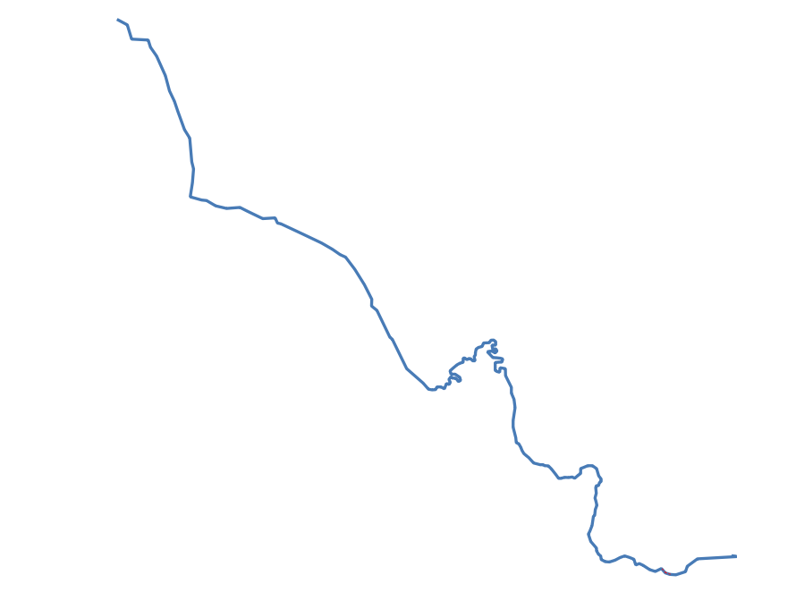

What is this?
=============

This is a geospatial file that contains the boundary of the Danelaw

 

What's the Danelaw?
==================

The Treaty of Alfred and Guthrum, was an agreement in the 9th century between King Alfred the Great of Wessex and Guthrum, the leader of the Danish Vikings, particularly those settled in East Anglia.

Alfred the Great was the King of Wessex, one of the Saxon kingdoms in England.

Guthrum was a Viking leader who had been leading raids and attempting to conquer various Anglo-Saxon territories.

The aim of the treaty of Alfred and Guthrum was to establish boundaries and terms for peaceful coexistence between the two parties.

The treaty isn't long, but one significant aspect of it, the first article, descibes the boundary between Anglo-Saxon England and the *Danelaw*, the area in which Danish law and influence held sway. The entire description of the first is:

> First as to the boundaries between us. They shall run up the Thames, and then up the Lea, and along the Lea to its source, then in a straight line to Bedford, and then up the Ouse to Watling Street.

[(Taken from https://en.wikipedia.org/wiki/Treaty_of_Alfred_and_Guthrum)](https://en.wikipedia.org/wiki/Treaty_of_Alfred_and_Guthrum)

And that's it. From that I just roughly drew the boundary in [QGIS](https://www.qgis.org) over the Ordnance Survey MiniScale Rasters, available at [https://osdatahub.os.uk/downloads/open/MiniScale](https://osdatahub.os.uk/downloads/open/MiniScale)

Notes
=====

It's very rough, perhaps not very accurate in places. It uses the modern day river courses that have doubtless changed over the course of a millenium. Having said that there's plenty of evidence to suggest this border wasn't patrolled by the Anglo-Saxon or Viking equivalent of the Border Force, and that it was a somewhat porous, flexible border.

License
========

[CC-by-SA 4.0 - https://creativecommons.org/licenses/by-sa/4.0/](https://creativecommons.org/licenses/by-sa/4.0/)

Contains OS data © Crown copyright and database right (2023)

